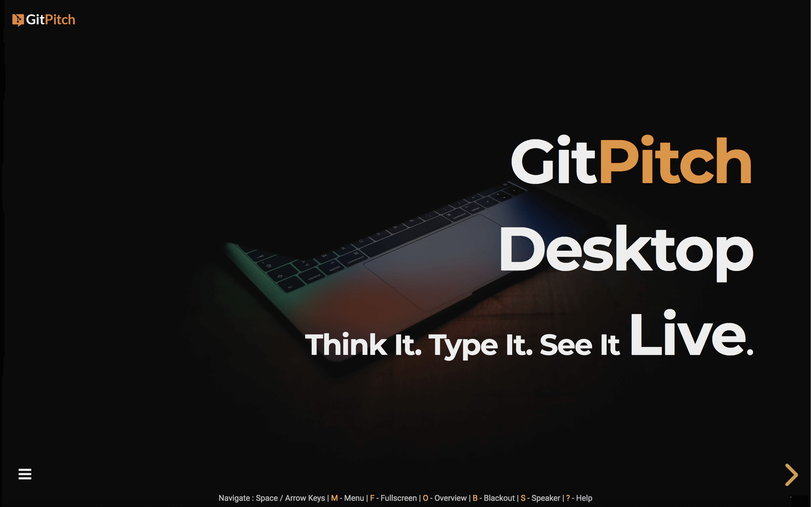
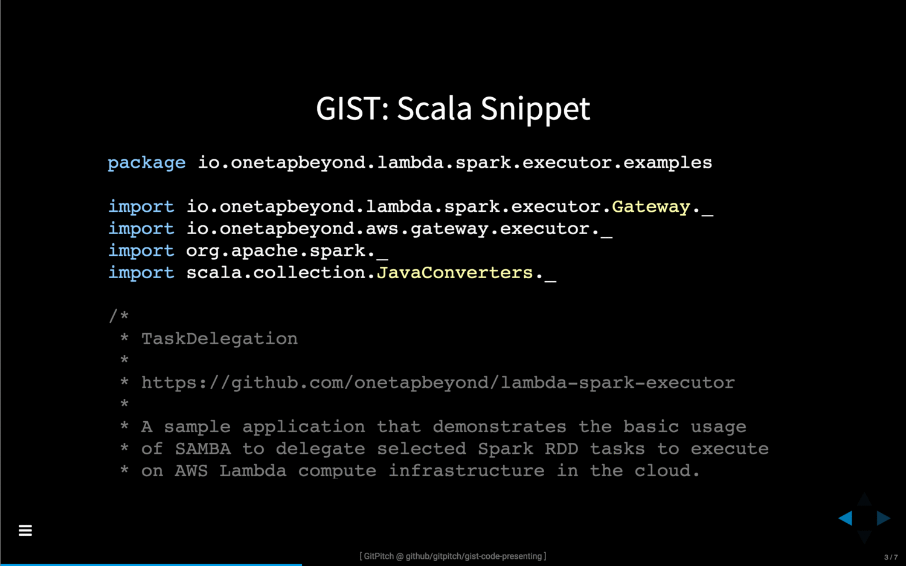
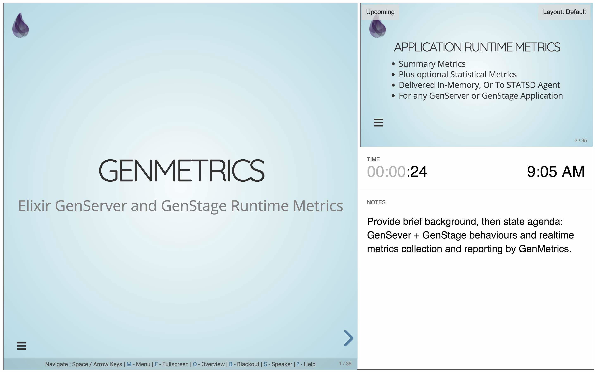

---?image=assets/img/presenter.jpg&opacity=100&size=cover
@title[HK]

@snap[north-west montserrat-heavy heading-white]
## HK@css[faded text-05](  23-05-2019)
@snapend

@snap[west raleway-medium h4-white span-50]
#### @css[text-smallcaps text-18](Hans & Tue)
@snapend

---
@snap[north-west montserrat-heavy heading-black]
## Agenda
@snapend

- 13:00 – 13:15    Velkommen
- 13:15 – 14:00    Jeres Opgave (Der er 4 grupper)
- 14:00 – 14:15    Pause
- 14:15 – 15:00    Sjov med innovativ IT
- 15:00 – 15:45    Hans
- 15:45 – 16:00    Opsamling/Spørgsmål

--- 

@snap[north-west montserrat-heavy heading-black]
## Jeres @css[faded text-05](Opgaver)
@snapend

- Big Data
- Synlighedsarrangementer – nytænkning
- App
- Robot

---

@snap[north-west montserrat-heavy heading-black]
## Sjov med innovativ @css[faded text-05](IT)
@snapend

+++?image=assets/img/audience.png&size=100% 40%

@snap[north-east raleway-medium span-55]
#### Loom@css[faded text-05](.org)
[Pro + Lite Desktop Docs @fa[external-link fa-font]](https://gitpitch.com/docs/pro-features/desktop)
@snapend

@snap[east span-50]

@snapend

@snap[west span-40 pro-feature-details]
@fa[quote-left] Loomio is an app that helps people have discussions and make decisions together
@snapend

+++?image=assets/img/audience.png&size=100% 40%

@snap[north-east raleway-medium span-55]
#### Sli@css[faded text-05](.do)
[Pro + Lite Desktop Docs @fa[external-link fa-font]](https://gitpitch.com/docs/pro-features/desktop)
@snapend

@snap[east span-50]

@snapend

@snap[west span-40 pro-feature-details]
@fa[quote-left] Every Question Matters.
The Ultimate Q&A and Polling Platform for Company Meetings and Events
@snapend

+++?image=assets/img/audience.png&opacity=100&color=#E58537&size=100% 40%
@title[Introduction]

@snap[north-west raleway-medium]
#### The Markdown Presentation Service on Git
@snapend

@snap[west montserrat-heavy heading-white]
# GitPitch@css[faded text-05](.com)
@snapend

+++?image=assets/img/audience.png&size=100% 40%

@snap[north-east raleway-medium span-55]
#### GitPitch Desktop
[Pro + Lite Desktop Docs @fa[external-link fa-font]](https://gitpitch.com/docs/pro-features/desktop)
@snapend

@snap[east span-50]

@snapend

@snap[west span-40 pro-feature-details]
@fa[quote-left] Enjoy a dedicated desktop tool on Linux, OSX, and Windows1 for developing and presenting offline. See local changes to your presentation instantly reflected in a live preview in your browser.
@snapend

+++?image=assets/img/audience.png&size=100% 40%

@snap[north-east raleway-medium span-55]
#### GitPitch Export
[Pro + Lite Desktop Docs @fa[external-link fa-font]](https://gitpitch.com/docs/pro-features/desktop)
@snapend

@snap[east span-50]

@snapend

@snap[west span-40 pro-feature-details]
@fa[quote-left] Use GitPitch Desktop to export any slide deck to Microsoft
PowerPoint & Office 365, Apple Keynote & Apple iCloud, Google Slides, PDF, and SlideShare.
@snapend

+++?image=assets/img/audience.png&size=100% 40%

@snap[north-east raleway-medium span-55]
#### GitPitch Security
[Pro Security Docs @fa[external-link fa-font]](https://gitpitch.com/docs/pro-features/security)
@snapend

@snap[east span-50]

@snapend

@snap[west span-40 pro-feature-details]
@fa[quote-left] Activate public, private, and password-protected slideshow presentations powered by private Git repositories. Use GitPitch to secure your content and manage your slideshow audience in the cloud.
@snapend

+++?image=assets/img/audience.png&size=100% 40%

@snap[north-east raleway-medium span-55]
#### GitPitch Surveys
[Pro Surveys Docs @fa[external-link fa-font]](https://gitpitch.com/docs/pro-features/surveys)
@snapend

@snap[east span-50]

@snapend

@snap[west span-40 pro-feature-details]
@fa[quote-left] Turn any slideshow into a two-way conversation. Deliver your message using a GitPitch slide deck. Then gather feedback from your audience long after you leave the stage using rich, professional surveys.
@snapend

+++?image=assets/img/audience.png&size=100% 40%

@snap[north-east raleway-medium span-55]
#### GitPitch Power
[Pro + Lite Power Docs @fa[external-link fa-font]](https://gitpitch.com/docs/pro-features/bonus)
@snapend

@snap[east span-50]

@snapend

@snap[west span-40 pro-feature-details]
@fa[quote-left] Beyond GitPitch Desktop, Security, and Surveys...Pro + Lite users enjoy powerful slideshow features including image opacity, UML diagrams, code zoom, Google Web Fonts, and Emojis @emoji[heart_eyes]
@snapend

+++

@snap[north raleway-medium span-80]
### Live Code Presenting
[Code Presenting Docs @fa[external-link fa-font]](https://gitpitch.com/docs/code-features)
@snapend

@snap[midpoint span-50]

@snapend

@snap[south span-100 feature-details]
Present any fenced code-block, repository source file, or GitHub GIST. Focus-on and step-through specific code snippets, loops, functions, output, etc. from directly within your slide deck @fa[quote-right]
@snapend     

+++

@snap[north raleway-medium span-80]
### Speaker Support
[Speaker Support Docs @fa[external-link fa-font]](https://gitpitch.com/docs/speaker-features)
@snapend

@snap[midpoint span-50]

@snapend

@snap[south span-100 feature-details]
Enjoy great features tailored specifically for conference speakers and training instructors. Including speaker notes, a dedicated speaker window, and support for remote control devices @fa[quote-right]
@snapend     

+++

@snap[north raleway-medium span-80]
### Modular Slideshows
[Modular Slideshows Docs @fa[external-link fa-font]](https://gitpitch.com/docs/git/branch-modular-slideshows)
@snapend

@snap[midpoint span-45]

@snapend

@snap[south span-100 feature-details]
Thanks to first-class support for modular markdown you can develop and publish modular slideshows. Share the complete slide deck. Or share select mini-decks with your audience @fa[quote-right]
@snapend
